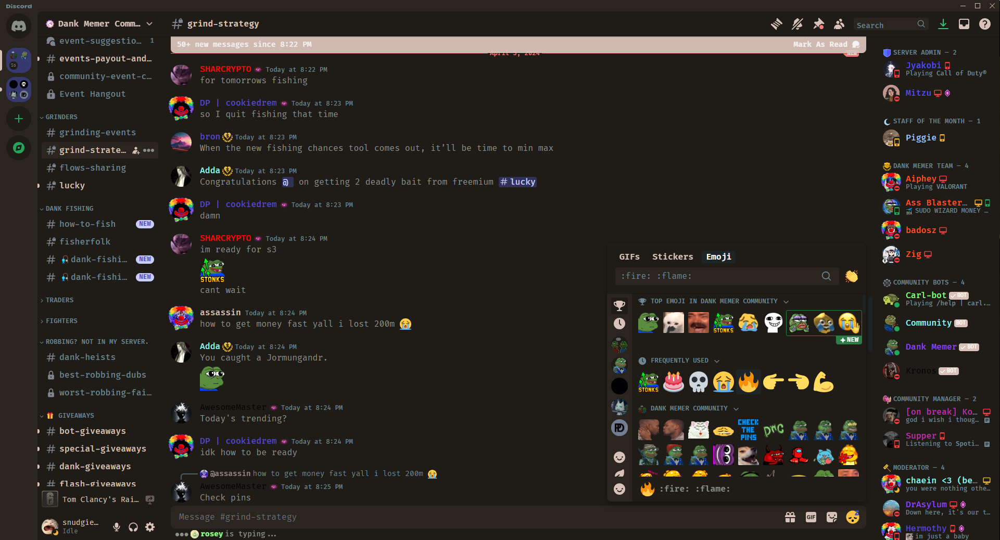

# Theme for discord




## Installation
### 1. Import Link:
```
https://venqoi.github.io/qoitheme/discord/venqoi.theme.css
```
- Vencord Themes: [link](https://github.com/Vendicated/Vencord) > `Settings` > `Themes` > `Online Themes` > paste this link in.
- any other mod which supports importing themes from raw links
  
### 2. CSS Import Link:
```css 
@import url('https://venqoi.github.io/qoitheme/discord/venqoi.theme.css');
```  
- Vencord QuickCSS: [link](https://github.com/Vendicated/Vencord) > `Settings` > `Vencord` > Enable `Use QuickCSS` > Click `Open QuickCSS File` > paste this link at the top
- Replugged QuickCSS: [link](https://replugged.dev) > `Settings` > `QuickCSS` Tab > paste this link at the top > Click `Apply Changes` button
- Openasar: [link](https://openasar.dev) > `OpenAsar Config` > `Theming` > paste this link at the top
- Any other mod which supports custom css.