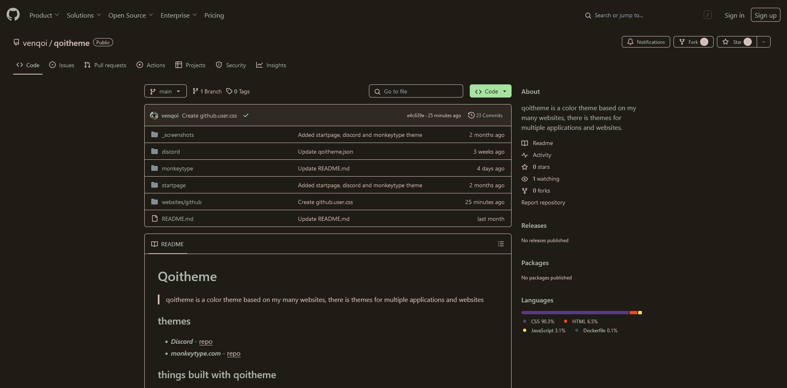

<h3 align="center">
 
	
  Qoitheme for <a href="https://github.com">GitHub</a>
</h3>

  

## Installation

Install [Stylus](https://github.com/openstyles/stylus) for your browser by clicking one of the badges below.

  
  

> [!TIP]
> If you use Chrome, make sure to enable "Allow access to file URLs" in the Stylus extension settings.

Switch to a default GitHub light/dark theme via **Settings** > **Appearance** for the best experience!

1. Enable CSP Patching from `Stylus Settings` > `Advanced`.
2. Install the theme:
- Install via [link](https://github.com/venqoi/qoitheme/raw/main/websites/github/github.user.css)   
- `https://github.com/venqoi/qoitheme/raw/main/websites/github/github.user.css`
3. Enjoy!

> [!TIP]
> For decentralized or self-hosted applications, you can apply a theme to one or multiple instances across updates by following the instructions below.
>
> 1. Open the Stylus "Manage" page.
> 2. Click on the userstyle's name in the list.
> 3. Click on **Style settings** in the left panel.
> 4. Enter the URL patterns for your instance(s) in the text box labeled **Custom included sites**.

&nbsp;
